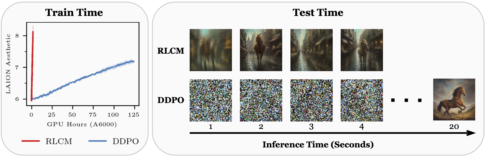
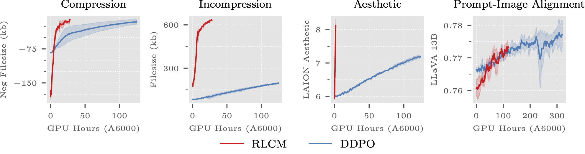
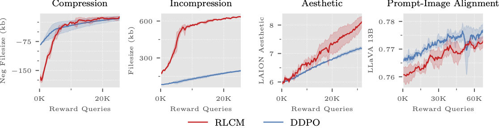

# Reinforcement Learning for Consistency Models (RLCM)

This is the official implementation of the paper [RL for Consistency Models: Reward Guided Text-to-Image Generation with Fast Inference](http://example.com). We support [low rank adaptation (LoRA)](https://arxiv.org/pdf/2106.09685.pdf) for finetuning a [latent consistency model (LCM)](https://arxiv.org/pdf/2310.04378.pdf). Much of this code was inspired by the repository for [Denoising Diffusion Policy Optimization (DDPO)](https://arxiv.org/pdf/2305.13301.pdf).



## Installation

In order to install the required clone this repository and run the `setup.py` file:
```bash
git clone https://github.com/Owen-Oertell/rlcm.git
cd rlcm
pip install -e . 
```
you must have python `>=3.10` installed.

## RLCM Training
RLCM is run by navigating into the `scripts` folder and then running the `main.py` file using accelerate. By default, we using the `compression` task but other tasks can be used.

To run the `aesthetic` task for example, we can run the following command.
```bash
accelerate launch main.py task=aesthetic
```

There are four tasks available: `prompt_image_alignment`, `aesthetic`, `compression`, and `incompression`. For more discussion about the tasks, please see the paper.

## RLCM Inference
We also provide a sample inference script once you have saved your models to disk. This script is located in the `scripts` folder and is called `inference.py`. You can run this script by running the following command (after editing it to point to your saved model):

```bash
python inference.py
```

## Summary of Hyperparameters
Below is a summary of the hyperparameters that can be used to train. Each task has its on hyperparameters. The default ones are given in `lcm_rl_pytorch/configs` and can be overwritten by passing them as arguments to the `main.py` script.
- `model`. The model that we are using to train. To use without modification it must use the LCM pipeline. This code uses `SimianLuo/LCM_Dreamshaper_v7`.
- `lr`. The learning rate for the policy gradient updates.
- `sample_batch_size_per_gpu`. The number of samples that are being collected per forward pass of the model.
- `train_batch_size_per_gpu`. How many we train after rebatching. For memory reasons, this is (much) smaller than the `sample_batch_size_per_gpu`.
- `num_sample_iters`. The number of times we do a forward pass for collecting samples before doing updates.
- `clip_range`. Clip range for the PG update.
- `max_grad_norm`. Max gradient norm we use for clipping.
- `adv_clip_max`. Max advantage when clipping advantages.
- `gradient_accumulation_steps`. Number of gradient accumulation steps.
- `num_epochs`. Number of epochs to train for.
- `num_inference_steps`. Number of inference steps for the LCM model. Usually higher is better quality but slower train and inference time.
- `batches_per_epoch`. Number of batches per epoch.
- `stat_buffer_size`. Rolling buffer size, used for computing the advantages
- `stat_min_count`. Minimum number of samples in the buffer before we start computing advantages per prompt instead of via a global mean.
- `num_inner_epochs`. Number of updates on a given batch. From our testing, 1 is usually sufficient.
- `lora_alpha`. Low rank adapatation alpha parameter.
- `lora_r`. Low rank adaptation rank parameter.
- `dataset`. Name of prompt dataset given in `lcm_rl_pytorch/core/dataloader.py`
- `reward_fn`. Name of reward function given in `lcm_rl_pytorch/rewards/rewards.py`
- `port`. For prompt image alignment task, we also have a port parameter to match the server port.

## Reproducing Results
We reproduce our results from the paper below. Please see the appendix for full information on hyperparameters and number of gpus used. At a high level however, we used 4 RTX a6000 gpus for each of the tasks where the `prompt image alignment` task was run with 3 gpus and 1 gpus for the server (from [kevin's repo](https://github.com/kvablack/LLaVA-server/). Make sure to use to 13b parameter version of LLaVA otherwise we've experienced empty outputs).



Plots of performance by runtime measured by GPU hours. We report the runtime on four NVIDIA RTX A6000 across three random seeds and plot the mean and standard deviation. We observe that in all tasks RLCM noticeably reduces the training time while achieving comparable or better reward score performance.



Training curves for RLCM and DDPO by number of reward queries on compressibility, incompressibility, aesthetic, and prompt image alignment. We plot three random seeds for each algorithm and plot the mean and standard deviation across those seeds. RLCM seems to produce either comparable or better reward optimization performance across these tasks.


## Citation
